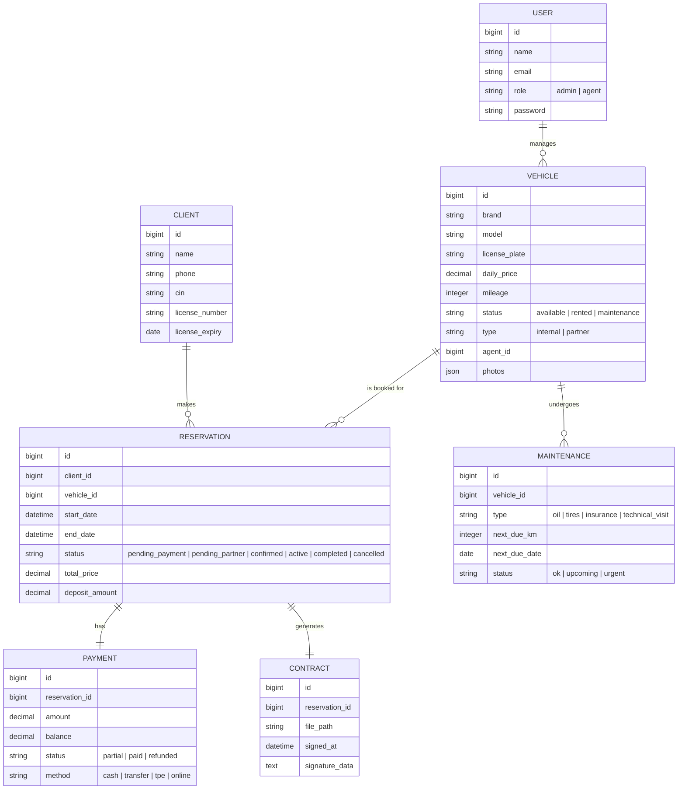

# Phase 0 — Analyse & Foundation

## 1. Architecture Globale

L'application sera structurée en trois piliers principaux communiquant via une API REST centralisée.

### Backend (Laravel 12+)
- **Architecture**: Domain-Driven Design (DDD) / Hexagonal.
- **Modules**:
  - `Domain`: Logique métier pure (Entités, Value Objects).
  - `Application`: Services de coordination (Use Cases).
  - `Infrastructure`: Implémentations techniques (Repositories, API Clients, DB).
  - `Interfaces`: Controllers API, Commandes Artisan.
- **Tools**: Laravel Filament (Admin), Sanctum (Auth), Redis (Queues), Horizon (Monitoring).

### Frontend (Next.js 15)
- **Framework**: React 19, Next.js App Router.
- **UI**: Tailwind CSS, Shadcn/UI (Premium Theme).
- **State Management**: React Query (Server State), Zustand (Client State).
- **SEO**: Optimisation SSR pour les pages publiques.

### Mobile (Flutter)
- **Framework**: Flutter 3.x.
- **State**: BLoC ou Provider.
- **Features**: Offline sync (Hive/SQLite), OCR (Google ML Kit), Signature (signature_pad).

---

## 2. Entity Relationship Diagram (ERD) Final

---

## 3. Mapping UML -> Modules

| Élément UML | Module Backend | Interface Frontend |
| :--- | :--- | :--- |
| Diagramme Cas d'Utilisation | `Auth`, `Fleet`, `Reservations` | Dashboard, Booking Page |
| Diagramme de Classes | `Core/Domain`, `Infrastructure` | DTOs, Typescript Types |
| Séquence (Réservation Web) | `AvailabilityEngine`, `Payments` | Booking Funnel |
| Séquence (Collaborateur) | `Collaborators`, `Notifications` | Partner Workflow |
| Séquence (App Mobile) | `Contracts`, `OCR-Service` | Agent Flutter App |
| Activité (Disponibilité) | `AvailabilityEngine` (Locking) | Calendar View |

---

## 4. Backlog Détaillé

### Phase 1: Setup (Prio: High)
- [ ] Task 1.1: Backend Laravel + Docker (PostgreSQL, Redis).
- [ ] Task 1.2: Frontend Next.js + Design System Premium (Shadcn).
- [ ] Task 1.3: Flutter Mobile Foundation.

### Phase 2: Core Auth & RBAC
- [ ] Implement Roles (Admin, Agent).
- [ ] Policy-based access for Vehicle and Reservation management.

### Phase 3: Fleet & Availability (Critical)
- [ ] Vehicle CRUD with photo uploads.
- [ ] **Availability Engine**: Algorithm for overlap detection with pessimistic locking.

### Phase 4: Reservation & Collaboration
- [ ] Booking workflow (Internal vs Partner).
- [ ] Partner validation logic (1h timeout).

### Phase 5: Finance & Documents
- [ ] Payment tracking (Partial payments, Deposit).
- [ ] PDF Contract generation + WhatsApp API integration.

---

## 5. Analyse des Risques & Gaps

- **Risque Concurrence**: Deux clients réservant le même véhicule simultanément.
  - *Solution*: Utilisation de `SELECT FOR UPDATE` (Pessimistic Locking) au moment de la création de la réservation.
- **Risque Offline Mobile**: Agent perd la connexion lors du scan.
  - *Solution*: File d'attente locale (Offline Sync) et synchronisation dès retour du réseau.
- **Gap Analysis**: Le cahier des charges ne précise pas la passerelle de paiement exacte (CMI mentionné comme "ready").
  - *Action*: Prévoir un adaptateur (Strategy Pattern) pour les paiements.

---

## 6. Validation Gate

**Statut**: En attente de validation de la Phase 0 par le client.
**Prochaine étape**: Phase 1.1 - Setup Backend & Docker.
