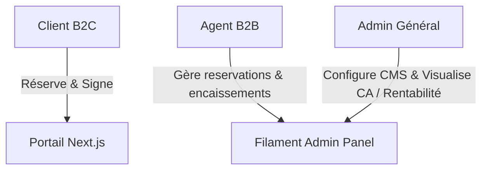
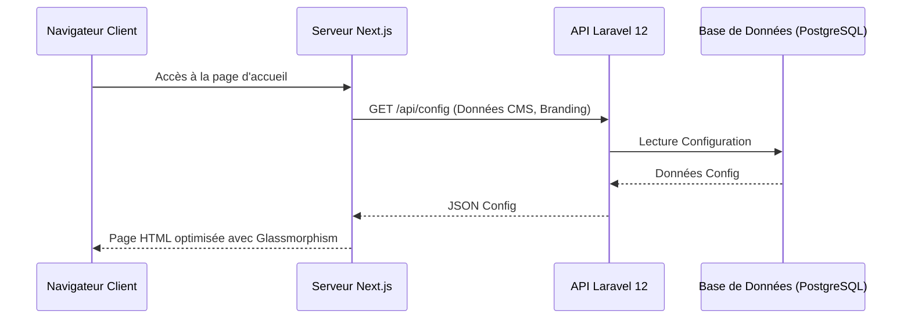
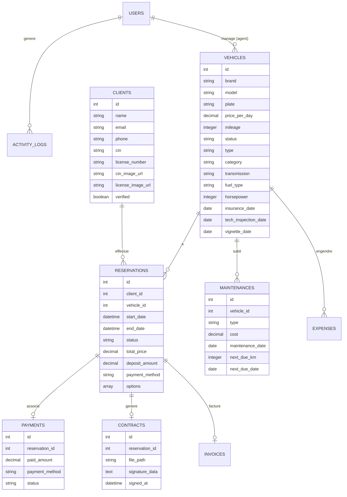
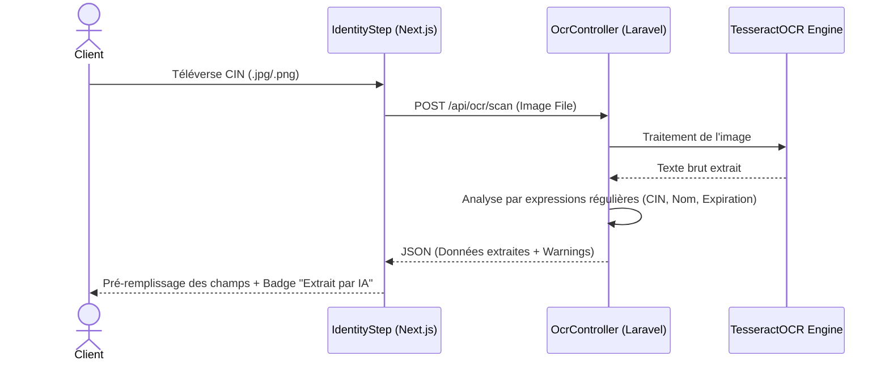

# 🚗 Rapport de Projet de Fin d'Études (PFE)
## Sujet : Conception et Réalisation d'une Plateforme SaaS de Gestion de Flotte et Location de Véhicules Premium (ERP B2B & Portail Client B2C)

---

> [!NOTE]
> **Ce document constitue le rapport de Projet de Fin d'Études (PFE) officiel pour le projet Vectoria Rent Car.** Il a été rédigé suite à l'analyse approfondie du code source (Next.js 14, Laravel 12, Filament v5, SQLite/PostgreSQL, Redis et APIs Stripe/WhatsApp).

---

## 📌 Table des Matières
1. [Introduction Générale](#1-introduction-générale)
2. [Chapitre 1 : Analyse des Besoins et Spécifications](#chapitre-1--analyse-des-besoins-et-spécifications)
3. [Chapitre 2 : Conception et Modélisation du Système](#chapitre-2--conception-et-modélisation-du-système)
4. [Chapitre 3 : Réalisation et Implémentation Technique](#chapitre-3--réalisation-et-implémentation-technique)
5. [Chapitre 4 : DevOps, Déploiement et Sécurité](#chapitre-4--devops-déploiement-et-sécurité)
6. [Conclusion Générale et Perspectives](#conclusion-générale-et-perspectives)

---

# 1. Introduction Générale

Le secteur de la location de voitures a connu une profonde mutation ces dernières années, portée par la numérisation des parcours clients et l'exigence croissante en matière d'expérience utilisateur. Les agences de location haut de gamme (segment Premium) font face à un défi double : offrir une vitrine en ligne immersive et luxueuse aux clients finaux (B2C), tout en disposant en arrière-plan d'un progiciel de gestion intégré (ERP B2B) puissant et fiable pour orchestrer la flotte, les contrats, la facturation et la maintenance.

Le projet **Vectoria Rent Car** répond précisément à cette problématique. Il s'agit d'une plateforme SaaS découplée, combinant :
- Un **portail web client (B2C)** d'inspiration luxe, doté d'un tunnel de réservation optimisé, d'un outil de sélection émotionnelle des véhicules (**Vibe Selector**) et d'un module de vérification d'identité intelligent par **OCR**.
- Un **ERP et Panel d'Administration (B2B)** pour les agents et administrateurs, leur permettant de piloter l'activité en temps réel : calendrier de réservations, génération automatique de contrats avec signature électronique, suivi de rentabilité des véhicules, facturation et gestion des dépenses.

Ce rapport retrace les différentes étapes de conception, de modélisation, de développement et de déploiement de cette plateforme d'excellence.

---

# Chapitre 1 : Analyse des Besoins et Spécifications

## 1.1 Contexte Général
Le marché de la location de voitures premium au Maroc requiert une réactivité maximale et une sécurité de transaction irréprochable. Les clients s'attendent à réserver un modèle spécifique et à finaliser leur contrat en quelques clics sans passer par des formulaires fastidieux ou des attentes interminables au comptoir.

## 1.2 Problématique
Les systèmes de location traditionnels souffrent de plusieurs limites :
1. **Les doubles réservations (Race Conditions)** : Deux clients réservant simultanément le même véhicule pour les mêmes dates.
2. **La lourdeur administrative** : Saisie manuelle des documents (CIN, Permis), rédaction manuelle des contrats physiques et processus de signature contraignants.
3. **L'opacité tarifaire** : Prix statiques ne reflétant pas la saisonnalité marocaine, la demande en temps réel (taux d'occupation) ou les jours de la semaine (week-ends).
4. **Le manque de visibilité métier** : Absence de rapports consolidés de rentabilité (Recettes - Dépenses de maintenance).

## 1.3 Identification des Acteurs
Le système interagit avec trois catégories d'utilisateurs distinctes :
- **Le Visiteur / Client B2C** : Parcourt la flotte, utilise des filtres ou le *Vibe Selector*, téléverse ses justificatifs, paie son acompte (Stripe/CMI) et signe son contrat en ligne.
- **L'Agent d'Agence** : Administre les contrats en agence, effectue des scans de documents, valide la conformité des identités et encaisse les paiements directs (Cash/TPE).
- **L'Administrateur Général** : Supervise l'ensemble du système, gère les utilisateurs (CRM), analyse la comptabilité de la flotte, configure les tarifs dynamiques et personnalise l'ordre et le contenu des sections de la vitrine (CMS).



## 1.4 Spécifications Fonctionnelles

### Espace Client (Portail Next.js)
- **Découverte Expérientielle** : Recherche par filtres (type, prix, transmission) et par humeur de voyage (*Vibe Selector* : Business Elite, Grand Tourisme, Wild Adventure, Family First).
- **Tunnel de Réservation Premium** : Sélection des dates de location, calcul du tarif dynamique en temps réel, choix des options (kilométrage illimité, flexibilité).
- **Vérification d'Identité Assistée par IA** : Extraction automatique des données (Nom complet, numéro de carte nationale, numéro de permis, date de validité) via un scan OCR de la CIN et du permis.
- **Signature Électronique Directe** : Signature numérique tactile ou à la souris sur écran pour acter le contrat de location.
- **Paiements Sécurisés** : Intégration de Stripe pour l'international et de CMI pour les cartes de paiement marocaines.

### ERP & Espace Administration (Laravel / Filament)
- **Tableau de Bord Décisionnel** : Graphiques de chiffre d'affaires, statistiques du taux d'occupation, alertes sur les documents de véhicules arrivant à échéance (assurance, visite technique, vignette).
- **Gestion Comptable & Rentabilité** : Enregistrement des dépenses (carburant, réparations) par véhicule et calcul de la marge nette (Profit/Loss).
- **Gestion Storefront (CMS)** : Modification des couleurs primaires, logos, et réorganisation dynamique de l'ordre des sections de la page d'accueil par Glisser-Déposer (Drag and Drop).

## 1.5 Spécifications Non-Fonctionnelles
- **Design & Esthétique** : Thème sombre et clair haut de gamme, effet de verre (Glassmorphism), animations fluides avec Framer Motion.
- **Haute Performance** : Requêtes asynchrones gérées par React Query pour éviter les rechargements de pages et mise en cache des configurations globales.
- **Concurrence & Sécurité** : Prévention stricte des doubles réservations par verrouillage pessimiste au niveau de la base de données.

---

# Chapitre 2 : Conception et Modélisation du Système

## 2.1 Architecture Logique Globale
L'application repose sur un modèle découplé (Headless Architecture) garantissant une évolutivité maximale :
- **Frontend** : Next.js 14 (App Router) hébergé de manière autonome, communiquant avec l'API Laravel via des requêtes REST sécurisées par jetons d'accès ou sessions d'authentification (Laravel Sanctum).
- **Backend API & ERP** : Laravel 12 encapsulant la logique métier pure dans des classes de Services, et Filament v5 pour la génération rapide de l'ERP interne B2B.



## 2.2 Modélisation de la Base de Données

Le schéma relationnel de la base de données est structuré pour suivre de manière rigoureuse le cycle de vie de la location et de la gestion de flotte :



## 2.3 Architecture Applicative & Modularité (DDD Modéré & Services)

Afin de garantir la maintenabilité, l'évolutivité et la collaboration parallélisée de l'équipe de développement, la plateforme a été conçue selon un paradigme hautement modulaire. Cette modularité s'articule à la fois sur la séparation physique des projets (découplage Frontend/Backend) et sur la structuration interne de chaque composant.

### A. Modularité du Frontend (Feature-Driven Architecture)
Le projet Next.js n'utilise pas une structure classique par type de fichier (tous les composants dans un dossier unique, toutes les pages dans un autre). À la place, il adopte une architecture orientée fonctionnalités (*Feature-Driven*), où chaque domaine fonctionnel de l'application est encapsulé dans son propre module sous `src/modules/` :
- `src/modules/fleet/` : Recherche, affichage des véhicules et filtres de recherche.
- `src/modules/booking/` : Étapes du tunnel de réservation (sélection des dates, calculs de prix, téléversements de pièces d'identité).
- `src/modules/payments/` : Formulaires Stripe, facturation et génération de reçus.
- `src/modules/ai/` : Interface utilisateur et logique d'interaction avec la Conciergerie Virtuelle intelligente.

Chaque module contient ses propres composants, hooks personnalisés, types et fonctions utilitaires. Cela permet d'isoler le code et d'éviter les régressions lorsqu'un module est mis à jour.

### B. Modularité du Backend (Architecture Orientée Services)
Côté Laravel, nous appliquons le principe de responsabilité unique (SRP). Les contrôleurs d'API (`Http/Controllers/Api/`) servent uniquement de points d'entrée et de sortie (validation des requêtes HTTP et retour des réponses JSON). Toute la logique métier complexe et le calcul des règles de gestion sont déportés dans des classes de Services autonomes situées dans le namespace `App\Services\` :
- **AvailabilityEngine** : Gestion exclusive des réservations et des verrous de concurrence.
- **PricingService** : Calcul du prix journalier dynamique et des règles de remise.

Cette séparation permet de tester chaque règle métier de manière unitaire et indépendante du contexte HTTP.


### C. Gestion de la Concurrence : L'AvailabilityEngine
Le problème majeur des plateformes de réservation est la condition de concurrence (*Race Condition*). Si deux requêtes HTTP tentent d'écrire en base pour le même véhicule en même temps, une double réservation peut survenir.
Pour pallier cela, la méthode `secureBooking` de [AvailabilityEngine](file:///c:/Users/PC/Desktop/workflow/VectoriaRentCar/backend/app/Services/AvailabilityEngine.php) utilise un **Verrou Pessimiste (Pessimistic Locking)** via l'instruction `lockForUpdate()` de Laravel (générant un `SELECT ... FOR UPDATE` en SQL) :

```php
return DB::transaction(function () use ($vehicleId, $start, $end, $reservationData) {
    // Verrouille la ligne du véhicule jusqu'à la fin de la transaction
    $vehicle = Vehicle::where('id', $vehicleId)->lockForUpdate()->first();

    if ($vehicle->status === 'maintenance') {
        throw new Exception('Vehicle is currently under maintenance.');
    }

    // Vérifie si un chevauchement existe
    $hasOverlap = Reservation::where('vehicle_id', $vehicleId)
        ->whereIn('status', ['pending_payment', 'pending_partner', 'confirmed', 'active'])
        ->where(function ($query) use ($start, $end) {
            $query->whereBetween('start_date', [$start, $end])
                ->orWhereBetween('end_date', [$start, $end])
                ->orWhere(function ($q) use ($start, $end) {
                    $q->where('start_date', '<=', $start)
                        ->where('end_date', '>=', $end);
                });
        })->exists();

    if ($hasOverlap) {
        throw new Exception('Double booking detected.');
    }

    // Création sécurisée de la réservation
    return Reservation::create([...]);
});
```

### D. Algorithme de Tarification Dynamique (PricingService)
Le calcul des prix de location n'est pas statique. La classe [PricingService](file:///c:/Users/PC/Desktop/workflow/VectoriaRentCar/backend/app/Services/PricingService.php) intègre un modèle algorithmique qui calcule le prix journalier en temps réel en combinant :
1. **Taux d'occupation global de la flotte** : 
   - Si occupation > 80% : Majoration de **+20%** (forte demande).
   - Si occupation < 30% : Réduction de **-10%** (offre spéciale basse saison).
2. **Saisonnalité Marocaine** : Haute saison (Juillet, Août, Décembre) appliquant une majoration de **+30%**.
3. **Majoration de Week-end** : Si le départ s'effectue un vendredi, samedi ou dimanche : majoration de **+10%**.
4. **Réductions de longue durée (Paliers Long-Stay)** :
   - Location $\ge$ 7 jours : Réduction de **-10%**.
   - Location $\ge$ 14 jours : Réduction de **-15%**.
5. **Suppléments d'options** : Annulation flexible (+60 MAD/jour) et kilométrage illimité (+140 MAD/jour).

Voici la formule globale appliquée par le service :
$$\text{Prix Journalier Dynamique} = \text{Tarif de Base} \times \text{Multiplicateur Dynamique}$$
$$\text{Prix Total} = (\text{Prix Journalier Dynamique} \times \text{Nombre de Jours}) + (\text{Tarif Option(s)} \times \text{Nombre de Jours})$$

---

# Chapitre 3 : Réalisation et Implémentation Technique

Le développement s'est appuyé sur une pile technologique moderne favorisant les performances, l'asynchronisme et un rendu visuel irréprochable.

## 3.1 Stack Technologique
- **Frontend** : Next.js 14 avec **App Router** pour le SSR (Server-Side Rendering) et la génération de métadonnées dynamiques (optimisation SEO automatique), **Tailwind CSS** pour l'intégration responsive, et **TanStack React Query** pour la gestion de l'état asynchrone et du cache API.
- **Backend ERP** : Laravel 12 configuré en API RESTful, associé à **Filament PHP v5** pour concevoir l'ERP d'administration de flotte de manière déclarative et réactive.
- **Moteur de Base de Données** : PostgreSQL en production pour sa robustesse transactionnelle, SQLite en environnement de développement pour sa légèreté.
- **Gestionnaire de Tâches & Notifications** : Redis pour le traitement asynchrone des files d'attente (Queues), Twilio pour les SMS et l'API Graph Meta pour les notifications interactives WhatsApp.

## 3.2 Focus sur les Fonctionnalités Clés

### A. Vibe Selector & Dynamic Storefront CMS
L'utilisateur B2C peut choisir son véhicule en fonction de la "vibe" (l'atmosphère) de son voyage via le composant [VibeSelector](file:///c:/Users/PC/Desktop/workflow/VectoriaRentCar/frontend/src/components/VibeSelector.tsx) :

```typescript
// Redirection émotionnelle vers la flotte filtrée
onClick={() => {
    router.push(`/fleet?lifestyle=${vibe.lifestyle}`);
}}
```

En parallèle, l'administrateur peut restructurer l'agencement de la vitrine client en direct depuis l'ERP. Filament v5 offre un panel où l'ordre des blocs (Hero, Comparator, VibeSelector, FAQ) est stocké dans la table `settings` sous forme de JSON et synchronisé instantanément avec Next.js qui applique le nouvel agencement grâce à un mappage dynamique de composants.

### B. IA Smart Verification (OCR)
Pendant le processus d'inscription ou de réservation, l'utilisateur charge des images de sa CIN ou de son Permis de conduire.
1. Le composant [IdentityStep](file:///c:/Users/PC/Desktop/workflow/VectoriaRentCar/frontend/src/modules/booking/components/IdentityStep.tsx) envoie l'image en `FormData` au backend via l'endpoint `/api/ocr/scan`.
2. Le contrôleur [OcrController](file:///c:/Users/PC/Desktop/workflow/VectoriaRentCar/backend/app/Http/Controllers/Api/OcrController.php) enregistre le document de manière sécurisée (dans un répertoire privé non-public) et exécute **Tesseract OCR** :
   ```php
   $ocr = new TesseractOCR($fullPath);
   $ocr->lang('fra', 'eng');
   $text = $ocr->run();
   ```
3. Des expressions régulières (Regex) adaptées analysent le texte brut pour extraire les informations sensibles :
   - **CIN Marocaine** : regex `/\b([A-Z]{1,2}[0-9]{4,6})\b/` (ex: AB123456).
   - **Numéro de Permis** : regex `/\b([0-9]{2}\/[0-9]{4,6}|[0-9]{8})\b/`.
   - **Nom complet & Dates de validité** : Heuristique de détection par mots-clés (`Nom`, `Valable`).
4. Si le document a expiré ou expire dans moins de 30 jours, des avertissements animés sont retournés au client.
5. Sur le frontend, les champs textuels sont pré-remplis automatiquement, avec l'apparition d'un badge animé **"EXTRAIT PAR IA"**, offrant une expérience utilisateur fluide et moderne.



### C. Signature Numérique & Génération de Contrat
Une fois l'identité vérifiée et le mode de paiement sélectionné, le client appose sa signature électronique directement sur un tableau tactile (Canvas HTML5). 
La signature est encodée sous forme de chaîne de caractères Base64 (données vectorielles d'image) et transmise au backend.
Le backend génère alors à la volée le contrat de location au format PDF (intégrant le logo dynamique de l'agence configuré dans le CMS, les clauses légales, les dates de location et la signature numérique). Le fichier est ensuite stocké dans un répertoire sécurisé pour l'archivage.

### D. Conciergerie Virtuelle Connectée (AI Chatbot)
Pour assister le client de manière interactive dans sa recherche de véhicule, un module de Conciergerie Virtuelle a été intégré :
1. Le client interagit en langage naturel via une interface de discussion (Chatbot) sur la page d'accueil, gérée par le hook React `useConcierge`.
2. Chaque message est transmis en méthode `POST` à l'endpoint `/api/concierge/chat` avec l'historique de la discussion pour conserver le contexte.
3. Le contrôleur `ConciergeController` analyse sémantiquement le message du client (recherche de mots-clés associés à des besoins spécifiques : *sport, famille, bagages, affaires, aventure*).
4. Le système interroge en temps réel la table `vehicles` en base de données pour extraire les modèles disponibles correspondants (ex: SUV pour la famille, Berlines pour le business), puis génère dynamiquement une réponse textuelle fluide accompagnée de suggestions cliquables de véhicules.
5. En cas d'indisponibilité réseau, le frontend dispose d'un mécanisme de bascule (*fallback*) vers un moteur de simulation local pour garantir la continuité de l'expérience utilisateur et fiabiliser les présentations.

---

# Chapitre 4 : DevOps, Déploiement et Sécurité

## 4.1 Conteneurisation avec Docker et Avantages de l'Orchestration

Afin de garantir une portabilité absolue et d'éviter les dérives de configuration entre les environnements (développement local et production), l'application est entièrement conteneurisée. Le fichier `docker-compose.prod.yml` orchestre **sept conteneurs isolés** fonctionnant en synergie :

1. **`gesrentcar-web` (Nginx)** : Il sert de Reverse Proxy d'entrée et de serveur HTTP. Il écoute publiquement sur le port `8080` (redirigé) et route le trafic vers les conteneurs adéquats : les requêtes d'API vers `gesrentcar-backend` et les requêtes web vers `gesrentcar-frontend`. Il gère également le partage de volumes pour servir de manière ultra-rapide les documents publics et les images de véhicules.
2. **`gesrentcar-frontend` (Next.js)** : Exécute l'application Next.js optimisée en mode autonome (*Standalone*), réduisant drastiquement l'empreinte mémoire de l'image de production.
3. **`gesrentcar-backend` (Laravel PHP-FPM)** : Fait tourner l'API REST Laravel 12 et le module ERP Filament v5.
4. **`gesrentcar-worker` (Laravel Queue Worker)** : Traite de manière asynchrone les tâches lourdes en arrière-plan (génération de PDFs, envoi de SMS via Twilio et de messages WhatsApp via l'API Graph de Meta) sans ralentir la navigation client.
5. **`gesrentcar-scheduler` (Laravel Scheduler)** : Conteneur autonome exécutant un démon Cron pour déclencher les tâches planifiées de l'application (sauvegardes régulières S3, audits quotidiens de fin de validité des documents de véhicules, détections des locations expirées).
6. **`gesrentcar-db` (PostgreSQL 15)** : Stocke de manière sécurisée toutes les données transactionnelles de l'ERP. Les données sont persistées sur l'hôte grâce à un volume Docker nommé `pgdata`.
7. **`gesrentcar-redis` (Redis 7)** : Sert de courtier de messages (*Message Broker*) rapide pour stocker temporairement les jobs de la file d'attente, ainsi que de cache pour les requêtes API fréquentes.

### Les Avantages Majeurs de cette Architecture Docker :

*   **Isomorphisme de l'Environnement** : L'environnement d'exécution est strictement le même sur l'ordinateur du développeur et sur le serveur VPS de production. Les bogues liés aux différences de versions logicielles de PHP, de Node.js, ou de packages système sont ainsi éliminés.
*   **Isolation Hermétique et Sécurité** : Chaque service possède ses propres dépendances, isolées des autres. Par exemple, la base de données PostgreSQL n'est pas exposée sur internet ; elle n'est accessible que par les conteneurs connectés au réseau interne privé de Docker.
*   **Mises à jour sans Interruption (*Zero Downtime*)** : Docker permet de reconstruire les images du frontend et du backend en arrière-plan pendant que l'ancienne version continue de tourner, puis de basculer instantanément vers les nouveaux conteneurs avec un temps d'arrêt nul.
*   **Scalabilité Horizontale Granulaire** : Si l'affluence B2C augmente, il est possible de dupliquer facilement les instances du frontend (`docker compose up --scale frontend=3`) ou d'ajouter de nouveaux workers pour traiter les notifications de masse, sans devoir cloner tout l'écosystème.
*   **Facilité d'Installation et DevOps** : Aucune dépendance (PHP, Node, Redis) n'a besoin d'être installée sur le serveur hôte. Une seule commande (`docker compose -f docker-compose.prod.yml up -d --build`) suffit pour déployer instantanément toute la plateforme.

## 4.2 Nginx et HTTPS (SSL Certbot)
Le serveur Nginx de l'hôte intercepte les requêtes externes sur les ports `80` et `443`. Les certificats de sécurité SSL sont configurés et renouvelés automatiquement grâce à **Certbot (Let's Encrypt)**, assurant le chiffrement de toutes les données sensibles (informations clients, signatures et identifiants de paiement).

## 4.3 Sécurité des Données Privées
Pour des raisons évidentes de confidentialité et de conformité (RGPD / CNDP au Maroc), les images téléversées des cartes nationales d'identité et des permis de conduire ne doivent jamais être accessibles publiquement via des URLs de stockage standards.
- Elles sont stockées dans le dossier `storage/app/private/`.
- L'accès est protégé par un middleware d'audit et de restriction d'accès. Seul un agent ou un administrateur authentifié peut interroger la route `/api/documents/preview/{filename}`, qui vérifie les droits de l'utilisateur connecté avant de diffuser le fichier de manière sécurisée sous forme de flux binaire temporaire.

---

# Conclusion Générale et Perspectives

Le projet de fin d'études **Vectoria Rent Car** a permis de concevoir et de réaliser une plateforme de location de véhicules haut de gamme particulièrement robuste. En s'appuyant sur des technologies modernes (Next.js 14, Laravel 12, Filament v5, TesseractOCR, Stripe), la plateforme résout les problèmes récurrents du secteur : les conditions de concurrence lors de la réservation (grâce au verrouillage pessimiste), la lourdeur du processus administratif (grâce à l'OCR intelligent et à la signature électronique), et la rigidité tarifaire (grâce à l'algorithme de prix dynamique).

### Perspectives d'évolution :
1. **Application Mobile Compagnon** : Développement d'une application mobile hybride (Flutter) permettant le déverrouillage connecté des véhicules équipés de boîtiers télématiques et la numérisation instantanée des documents d'identité par OCR.
2. **Analyse Automatique de Dégâts par Computer Vision** : Intégration d'un modèle d'intelligence artificielle (TensorFlow/PyTorch) analysant les photos de départ et de retour pour identifier automatiquement les rayures ou chocs sur la carrosserie et estimer instantanément le coût des réparations.
3. **Statistiques Prédictives** : Utilisation de modèles de Machine Learning pour anticiper la demande et optimiser automatiquement les achats de véhicules de la flotte.
